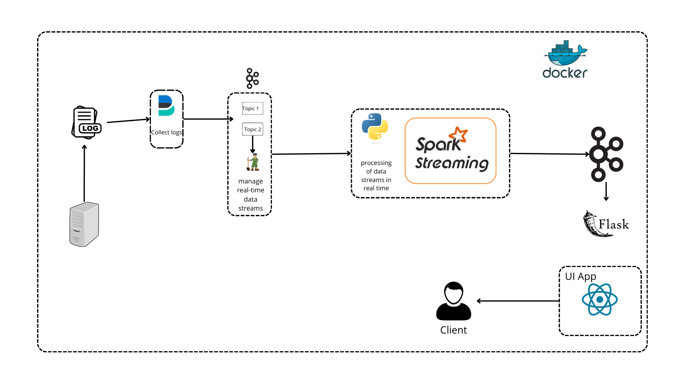

# 🚀 Real-Time Log Processing Pipeline

Un pipeline de traitement de logs en temps réel construit avec **Filebeat**, **Kafka**, **Spark Streaming**, **Flask** et une **interface React** — le tout orchestré avec **Docker**.

---

## 🧭 Aperçu de l'architecture

Voici le schéma du pipeline :



### 🔄 Fonctionnement

1. **Filebeat** collecte les logs depuis des fichiers systèmes ou applicatifs.
2. Les logs sont envoyés à **Kafka**, qui gère les flux de données en temps réel via des topics.
3. **Spark Streaming** consomme les données Kafka et les traite en temps réel.
4. Les données traitées sont renvoyées à Kafka ou directement exposées via une **API Flask**.
5. Une **interface React** consomme l’API pour afficher les logs et métriques en temps réel.

---

## 🛠️ Technologies utilisées

| Outil         | Rôle                                    |
|---------------|-----------------------------------------|
| 📝 Filebeat    | Collecte des fichiers de logs           |
| 🛰️ Kafka       | Broker de messages pour les données      |
| ⚡ Spark       | Traitement de flux en temps réel        |
| 🐍 Flask       | Exposition des données via une API REST |
| ⚛️ React       | Dashboard pour visualiser les données    |
| 🐳 Docker      | Conteneurisation et orchestration       |

---

## 📂 Structure du projet
```batch 
 Real-Time Log Processing Pipeline:.
├── api/ # API Flask pour l'exposition des données
│ ├── api.py # Points d'entrée de l'API
│ ├── requirements.txt # Dépendances Python
│ └── mon_env/ # Environnement virtuel
│
├── assets/ # Ressources visuelles
│ ├── architecture.png # Diagramme d'architecture
│ └── dashboard.png # Capture du dashboard
│
├── backend/ # Services backend
│ ├── kafka/ # Configuration Kafka
│ │ └── src/ # Code source des producteurs/consommateurs
│ │
│ └── spark/ # Traitement Spark
│ └── spark.py # Jobs Spark Streaming
│
├── config/ # Configurations
│ └── filebeat/
│ └── filebeat.yml # Configuration Filebeat
│
├── front-end/ # Application React
│ ├── public/ # Fichiers statiques
│ ├── src/ # Code source React
│ ├── .gitignore
│ ├── package.json # Dépendances frontend
│ └── package-lock.json
│
├── .gitignore # Fichiers exclus du versioning
├── docker-compose.yml # Orchestration des containers
├── generated_logs.log # Exemple de logs générés
└── README.md # Ce fichier
```
## 🚀 Lancement du projet

1. **Cloner le projet :**

```bash
git clone https://github.com/votre-utilisateur/Big-Data-Project.git
```
2. **Deployer les dependences :**
```bash
cd Real-Time Log Processing Pipeline
docker-compose up
```
3. **Excuter Spark Streaming :**
```bash
docker exec -it spark-master spark-submit --packages org.apache.spark:spark-sql-kafka-0-10_2.12:3.2.0 /app/spark.py
```
## 📊 Dashboard
**Lancer le dashboard React :**
```bash
http://localhost:3000
```
